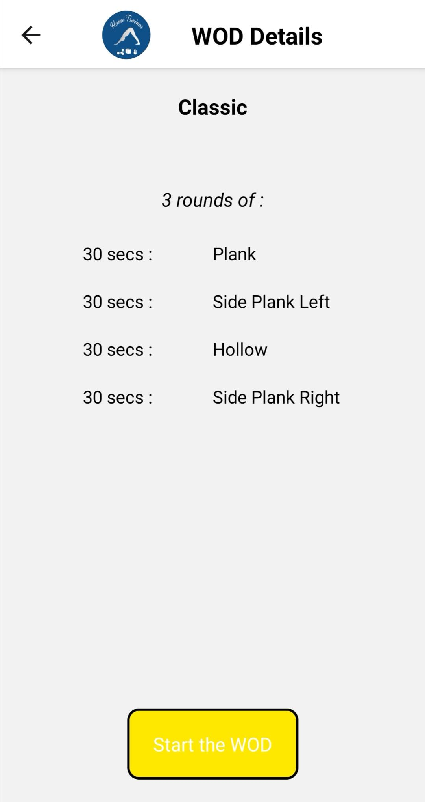

# HOME TRAINER

This repository includes my mobile development project : **_HomeTrainer_**.

This **React-native** project is my second mobile application project. First time I developed an Android application with Android Studio and programming language **java**.

Here I learnt how to use React Native with an OpenClassrooms training [Développez une application mobile React Native](https://openclassrooms.com/fr/courses/4902061-developpez-une-application-mobile-react-native?status=published).

I decided to work on a home training application for several reasons. First, I'm found of sport and especially handball and crossfit. I'm used to practice home workout when I can't go to my crossfit box. And I began this application during COVID-19 quarantine, so I had time to train and code, but not the perfect mobile application to train. :smile:

I then decided to start a mobile application, to help people train at home, and monitor their own performances and evolution. :muscle:

## Try the application

You have 2 possibilities to try my application, you can test it both locally and download it on Play Store.

### Play Store : download the application

The application is available on the **Play Store** for Android phones. Unfortunately, I didn't deploy my application on the App Store, due to the huge price of Apple licence, sorry for IOS users. :smirk:

You will find the application at this link [HomeTrainer](https://play.google.com/store/apps/details?id=com.JulienVerdun.HomeTrainer). Make sure to give a grade to the application :star: :star: :star: and leave a comment for me to have a feedback and improve the application.

### Locally : try it with Expo

If you don't have an Android phone or want to test it locally on your device, you can follow the below instructions :

- Download this project on your computer
- Make sur you have _Node.js_ and **git** install on your computer
- Run the following command lines to install the packages and run the application :

```
npm install
npm start
```

On your phone, download _Expo_, and use it to try the application.

## Description

This application allows everyone to program and follow trainings and monitor his performances.

### Trainings


The application provides a range of trainings of different types : AMRAP, For Time, etc. The user can choose a training and open the details.


He will found the details of the training :

- the number of rounds
- the time or number of repetitions per exercise
- the exercise name and decription.

The user can the **Start the WOD** and follow the instructions to realise the training.


### Use the timer mode to follow a training

If the user only want a clock to monitor is performance, a menu provides different time of clock :

- a classic clock : user can start, stop, reload and even save lap time
- an AMRAP clock : user defines a total time and train until the sound ring out.
- an interval clock : user defines a training time, a rest time and a total time and then train during training time and rest otherwise. A sound lets user know about change.

### Follow your progress with the historic

The user can store his performances for For Time trainings, and follow his progress among time.

### Learn new training with the illustrated exercise explanations

The user can discover new trainings. A page provides for every exercise, a description and an illustration of the exercise.


## Technical choices

The application was developed with **React Native** framework.
I chose React Native because it is an open source and crossplatform mobile-application framework.

I use **redux** and **redux-persist** to manage data and data storage in my application because it is a convenient and easy way to do so.
There is no connection to any API or server, the application is totally independant and don't need an internet connection.

The trainings, exercise descriptions and images are stored on a mongodb database\*\*.

A **Node JS** server is running to access the informations from the database.

Currently, the server and the database are only running locally, they are not deployed. It is the next step for my application.

## Improvement ways

- Store all trainings, exercise descriptions and images on a remote server, and access data with an API, to reduce the size of the application.
- Provide a more important range of training choices.
- Provide for every exercise different level of difficulty.
- Allow user to select training depending on his equipments.
